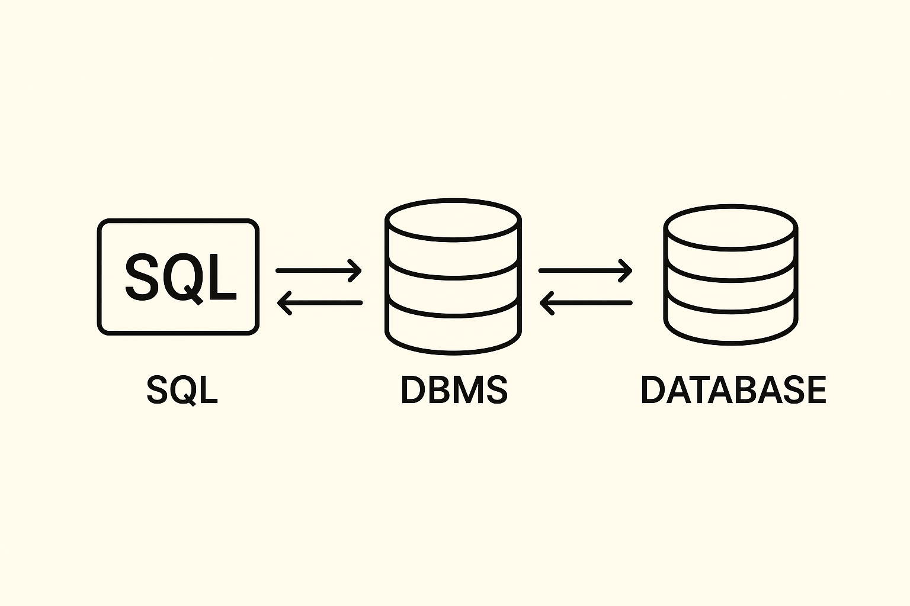

# SQL-notes

## Table of Contents

- [Database and its Concepts](#database-and-its-concepts)
  - [Database Management System](#database-management-system)
  - [Database Architecture](#database-architecture)
  - [Data Models](#data-models)
    - [The History of Data Modeling](#the-history-of-data-modeling)
    - [Data models and the relational model](#data-models-and-the-relational-model)
    - [Centralized vs Distributed Databases](#centralized-vs-distributed-databases)
  - [SQL](#SQL)
  - [NoSQL](#NoSQL)
- [Relational Model](#relational-model)
- [Database Queries](#database-queries)
- [Manipulating Data](#manipulating-data)
- [Designing Database Structure](#designing-database-structure)
- [Normalization](#normalization)
- [Database Performance](#database-performance)
- [Database Security](#database-security)
- [Open Interfaces and NoSQL](#open-interfaces-and-nosql)

# Database and its Concepts

**Data** - Raw facts or pieces of information that are stored and managed in a database.

> Note: Data != Information

| Feature        | Data                                            | Information                                                |
| -------------- | ----------------------------------------------- | ---------------------------------------------------------- |
| Definition     | Raw facts, figures, or symbols without context. | Processed or organized data that is meaningful and useful. |
| Nature         | Unprocessed, unorganized.                       | Processed, structured, and organized.                      |
| Meaning        | No inherent meaning on its own.                 | Has meaning and provides insight.                          |
| Example        | 25, 30, 45, 60                                  | Average temperature is 40°C.                               |
| Purpose        | Collected for reference or processing.          | Used for decision-making and understanding.                |
| Representation | Can be numbers, text, images, or signals.       | Usually a report, summary, or analysis derived from data.  |
| Value          | Low intrinsic value until processed.            | High value because it supports decisions.                  |

**Data is like raw material; information is the finished product that helps you make decisions.**

A computer database is an organized collection of electronic data designed for efficient storage, retrieval, and manipulation by authorized users. Similar in concept to traditional index cards but far more advanced, databases store only necessary, standardized data tailored to the needs of their users. Their size and complexity can range from simple home recipe collections to massive systems managing millions of customer transactions.

A database contains only data relevant to its defined purpose, excluding any unnecessary or unrelated information. During its design, the intended use is clearly specified, ensuring all stored data is logically connected. For example, a library database would include information about loanable items and their details but not unrelated data like weather forecasts. This purposeful organization distinguishes a true database from random, unstructured data collections.

> Note: Information systems and databases transform raw data into
> meaningful information and knowledge to support decision-making through
> context, aggregation, and analysis.

A database is designed with specific, known users in mind, as its purpose is to serve their needs. Identifying users is essential to determine what data should be stored. For instance, a library database is tailored for visitors and staff, providing information relevant to their requirements, such as item details and availability. This user-focused design distinguishes databases from random data collections.

**Real-world Databases Examples:**

1.  Social Media Platforms:
    • Store user profiles, posts, comments, and likes, ensuring quick retrieval and consistency.
    • Analyze user interactions and trends for recommendations, ads, and content personalization.

2.  Library Systems:
    • Track books, borrowers, loans, and reservations with consistent and searchable records.
    • Analyze borrowing patterns to optimize inventory and suggest popular books.

3.  E-commerce Platforms:
    • Manage products, orders, customer accounts, and inventory with reliable transactions.
    • Analyze purchase history and user behavior for personalized recommendations and promotions.

Every database follows a specific data model that defines how data is stored, presented, and manipulated with precision. The model determines the structure of data units (records), their types, and the relationships between them, shaping how users view and interact with the data. It enables the creation of complex information by connecting simple data records through defined semantic relationships.

**Key Features:**

|                                                                      Structured Data |                                                                                        Scalability |                                                      Integrity and Security |                                                      Persistence |
| -----------------------------------------------------------------------------------: | -------------------------------------------------------------------------------------------------: | --------------------------------------------------------------------------: | ---------------------------------------------------------------: |
| Data is stored in tables that are connected, keeping it organized and easy to search | Databases can manage more data and users efficiently using methods like splitting and copying data | Databases keep data accurate with rules and protect it with access controls | Committed data stays saved even if the system restarts or crashe |

**Why Use a Database?**

🔄 Data Consistency – Ensures information is accurate and uniform across the database.

🔒 Data Security – Protects data from unauthorized access or breaches.

💾 Data Persistence – Data remains saved even after system restarts or crashes.

✅ Data Integrity – Maintains correctness through rules like constraints and validations.

⚡ Efficient Data Management – Handles large amounts of data and multiple users smoothly.

🔍 Data Accessibility – Allows easy retrieval and querying of data when needed.

📈 Scalability – Can grow with more data, users, or workload without losing performance.

📄 Data Redundancy Reduction – Avoid storing the same data in multiple places, reducing inconsistencies.

### Database Management System

**A Database Management System (DBMS)** is essential software that enables users to interact with databases, which are typically <ins>too complex</ins> for direct access. Acting as an intermediary between users and the database, the DBMS allows for creating, modifying, and managing databases through standardized communication, such as SQL in relational databases.

While it simplifies database operations, effective use often requires knowledge of SQL and the data model, which is why client programs frequently handle this interaction for end-users.

| DBMS Type               | Description                                   | Examples                                                          |
| ----------------------- | --------------------------------------------- | ----------------------------------------------------------------- |
| Relational DBMS (RDBMS) | Data stored in tables (rows & columns).       | MySQL, PostgreSQL, Oracle Database, Microsoft SQL Server, MariaDB |
| NoSQL DBMS              | Handles unstructured or semi-structured data. | MongoDB, Cassandra, Redis, CouchDB, Neo4j                         |
| Object-oriented DBMS    | Stores data as objects (used in programming). | db4o, ObjectDB                                                    |
| Hierarchical DBMS       | Data organized in a tree-like structure.      | IBM IMS                                                           |
| Network DBMS            | Data organized as records connected by links. | IDMS                                                              |

**A Database Management System (DBMS)** is essential for handling the inherent complexity of modern, multi-user databases. Commercial database products primarily provide a DBMS, as it enables creating, accessing, and maintaining databases. The DBMS also determines the supported data models, meaning a relational DBMS is required for managing relational databases and performing key administrative tasks.

<p align="center">
  
</p>

_Figure 1: SQL sends queries to the DBMS, which interacts with the database._

A Database System has several main components that work together to store, manage, and retrieve data efficiently.

🗄 Hardware – Physical devices like servers, storage, and network equipment where the database runs.

💻 Software – The Database Management System (DBMS) software that controls data storage, queries, and security.

🧑‍💼 Users – People who interact with the database, like administrators, developers, and end-users.

> Note: A Database Administrator (DBA) manages the database, ensuring security, availability, user access, and license management.

> Note: End users are the one who store, retrieve, update and delete data.

📦 Data – The actual information stored in the database (tables, records, etc.).

⚙️ Procedures – Rules, guidelines, and operations for using and managing the database.

🛠 Database Engine – Core part of DBMS that handles data storage, retrieval, and processing.

🔐 Database Schema / Metadata – Structure and organization of the database (tables, columns, relationships).

### Database Architecture

**Database architecture** defines how the database system is structured, how data is stored, managed, and accessed. It determines the interaction between the user, application, and the database.

There are generally three main levels of database architecture:

<table>
  <thead>
    <tr>
      <th>Level</th>
      <th>Description</th>
      <th>Example/Notes</th>
    </tr>
  </thead>
  <tbody>
    <tr>
      <td>Internal Level (Physical)</td>
      <td>How data is physically stored on storage devices (disk, SSD, etc.).</td>
      <td>Storage structures, indexes, file organization.</td>
    </tr>
    <tr>
      <td>Conceptual Level (Logical)</td>
      <td>Defines the logical structure of the entire database without worrying about physical storage.</td>
      <td>Tables, relationships, constraints.</td>
    </tr>
    <tr>
      <td>External Level (View)</td>
      <td>How users see and interact with the data. Multiple user views can exist.</td>
      <td>Reports, queries, application interfaces.</td>
    </tr>
  </tbody>
</table>

**Types of Database Architecture**

✅ Single-tier Architecture

Database and application reside on the same machine.

<ins>Rarely</ins> used today.

<ins>Example:</ins> a desktop or mobile app with its own local database.

✅ Two-tier Architecture

Client (user interface) ↔ Database Server.
Clients connect directly to a database server.

<ins>Example:</ins> A desktop app querying a database directly, with a central
database.

✅ Three-tier Architecture

Client ↔ Application Server ↔ Database Server.

Most common in modern web apps.

Pros: Better security, scalability, and maintainability.

#### Centralized vs Distributed Databases

**Centralized Database**

A centralized database stores all data in a single location, typically on a single server. All users and applications access this central system.

**Features:**

📍 Data is stored in one location.

📍 Easier to manage, secure, and maintain.

📍 Performance can be affected if too many users access simultaneously.

📍 If the central server fails, the whole system goes down.

<ins>Example:</ins> A university storing all student records in one main server.

**Distributed Database**

A distributed database stores data across multiple locations or servers, which are connected via a network. Users can access data from the nearest or most appropriate server.

**Features:**

📍 Data is distributed across multiple sites.

📍 Faster access for geographically spread users.

📍 System is more fault-tolerant; one server failing doesn’t crash the entire system.

📍 More complex to manage and maintain consistency.

<ins>Example:</ins> Online shopping platforms storing product data across servers in different countries.

| Feature         | Centralized Database          | Distributed Database                    |
| --------------- | ----------------------------- | --------------------------------------- |
| Data Location   | Single central server         | Multiple servers at different locations |
| Management      | Easier to manage              | More complex to manage                  |
| Performance     | Can slow down with many users | Faster for local users                  |
| Fault Tolerance | Single point of failure       | More fault-tolerant                     |
| Cost            | Lower setup cost              | Higher setup and maintenance cost       |
| Example         | University main database      | Global e-commerce database              |

### Data Models

**A data model** defines the logical structure and rules for how data is presented and manipulated in a database but does not determine its physical storage. The physical structure—how data is written, stored, and retrieved—is handled by the database software and remains hidden from users. Thus, databases using the same data model, such as the relational model, appear similar to users while functioning differently internally.

**Database modeling** is designing how data is organized, stored, and accessed to ensure consistency, efficiency, and scalability for applications.

#### The History of Data Modeling

**1960s – 1970s:** Early databases were hierarchical (IBM IMS) and network (CODASYL); data models were rigid.

**1970s:** Relational model introduced by E.F. Codd, organizing data in tables with SQL for queries.

**1980s:** Entity-Relationship (ER) modeling developed by Peter Chen to visually represent data and relationships.

**1990s – 2000s:** Object-oriented and object-relational databases emerged to handle complex data types.

**2000s** – Present: NoSQL and Big Data models became popular for unstructured and distributed data.

<table>
  <thead>
    <tr>
      <th>Data Model</th>
      <th>Main Principle</th>
      <th>Key Notes</th>
    </tr>
  </thead>
  <tbody>
    <tr>
      <td>Hierarchical</td>
      <td>Data organized in a tree-like structure</td>
      <td>Parent-child relationships; rigid and hard to modify</td>
    </tr>
    <tr>
      <td>Network</td>
      <td>Data represented as records connected by links</td>
      <td>Flexible many-to-many relationships; used in CODASYL DBs</td>
    </tr>
    <tr>
      <td>Relational</td>
      <td>Data stored in tables with rows and columns</td>
      <td>Introduced by E.F. Codd; supports SQL queries</td>
    </tr>
    <tr>
      <td>Entity-Relationship (ER)</td>
      <td>Data and relationships modeled visually as entities and links</td>
      <td>Developed by Peter Chen; used for database design</td>
    </tr>
    <tr>
      <td>Object-Oriented</td>
      <td>Data stored as objects like in programming languages</td>
      <td>Supports complex data types and inheritance</td>
    </tr>
    <tr>
      <td>NoSQL / Big Data</td>
      <td>Handles unstructured and distributed data</td>
      <td>Includes document, key-value, column, and graph databases</td>
    </tr>
  </tbody>
</table>

**The relational model** is a standardized data model used in relational databases, which adhere strictly to its principles. However, some relational DBMSs support extended forms, such as object-relational databases, that integrate object-oriented features. These hybrid models combine aspects of relational and object-oriented approaches but are usually vendor-specific and non-standard.

#### Data models and the relational model

The relational model centers on the concept of <ins>relations</ins>, which represent all data and operations within the system. Its strength lies in providing semantic meaning by defining how data items relate to each other, enabling users to extract meaningful information rather than just isolated data.

For example, in a library database, relations can link books to authors, publishers, and borrowing history, creating valuable insights from connected data rather than standalone records.

### SQL

**SQL (Structured Query Language)** is a standardized language used mainly in <ins>relational databases</ins> for querying, manipulating, and managing data. While integral to relational systems, it does not fully adhere to the relational model, allowing structures that may violate strict relational rules (e.g., duplicate rows, missing primary keys). Users must understand the relational model to apply SQL correctly, and DBMSs often enforce constraints to prevent improper use.

```sql
SELECT first_name, last_name
FROM employees;
```

### NoSQL

**NoSQL (Not Only SQL)** databases are designed to handle unstructured, semi-structured, or large-scale distributed data. Unlike relational databases, they don’t require fixed schemas and can store data as key-value pairs, documents, columns, or graphs.

**Key points:**

📍 Flexible schema, suitable for changing data structures.

📍 Scales easily across multiple servers (horizontal scaling).

📍 Types include Document (MongoDB), Key-Value (Redis), Column (Cassandra), Graph (Neo4j).

📍 Commonly used in big data, real-time apps, and web applications.

# Relational Model

The relational model is built around the concept of a **relation (table)**, which sets it apart from earlier record-based models.
**Records (rows)** exist only within relations, and all data in the model is stored or represented as part of a relation.

The top row of a table is highlighted to show the **attributes** — the properties that define what kind of data each column can store.
Each column has an attribute specifying its **data type** (e.g., text, number, date) and **domain** (the allowed range of values).
For example, the column <ins>Price</ins> might have a data type of <ins>decimal</ins> and a <ins>domain</ins> of 0.00–1000.00.
